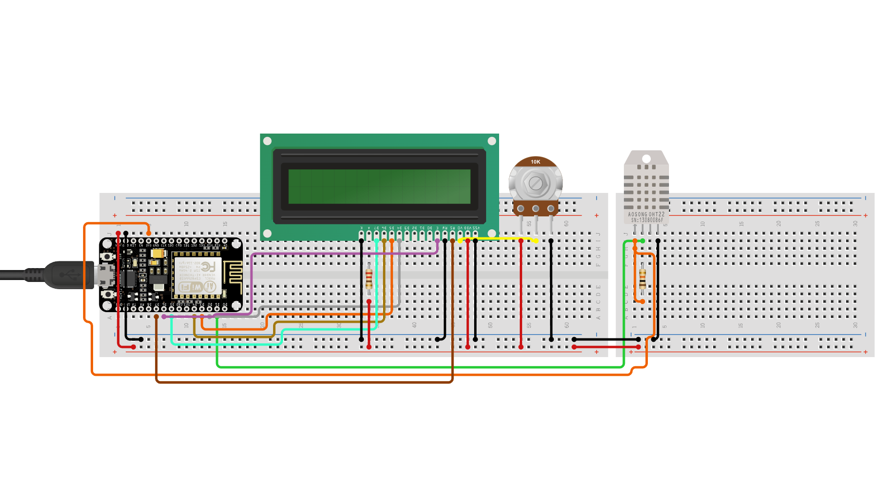
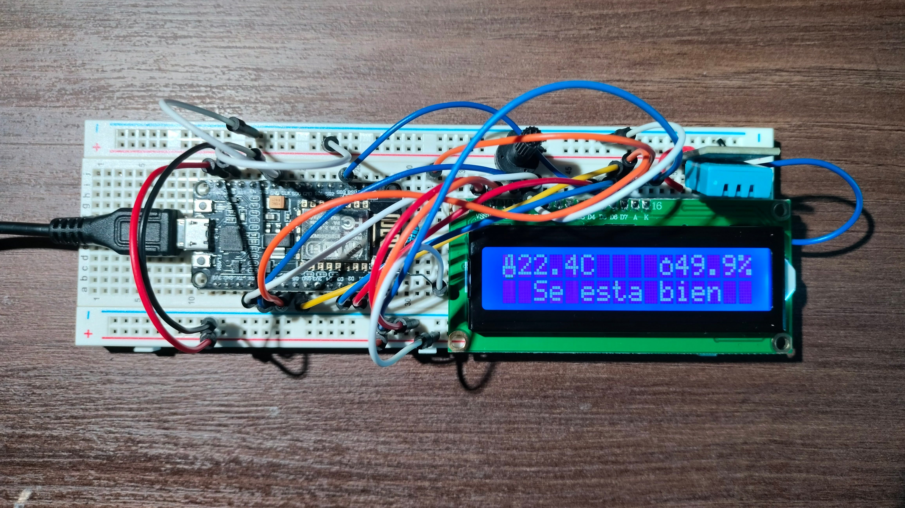

# Arduino NodeMCU 12E - Home Temperature and Humidity Meter

## Introduction

This project involves creating a Home Temperature and Humidity Meter using a
NodeMCU ESP8266-12E, a DHT11 sensor, and a LCD1602 screen. The DHT11 sensor is
responsible for measuring the temperature and humidity levels, and the LCD1602
screen displays the real-time data.

Right now I am not making any use for the WiFi module, but I plan to connect the
sensor data to a web service and create an IoT application.

## Components Used

- NodeMCU ESP8266-12E
- DHT11 Sensor
- LCD1602 Screen
- Breadboard and Jumper Wires

## Features

- Real-time temperature and humidity monitoring.
- Display of temperature and humidity readings on the LCD1602 screen.
- Display a message based on the Heat Index.

## Wiring Diagram

## Pictures

## How to Use

1. Connect the components according to the provided wiring diagram.
2. Upload the Arduino sketch to your NodeMCU.
3. Monitor the temperature and humidity readings on the LCD1602 screen.

## Additional Notes

- Ensure that the necessary libraries are installed in the Arduino IDE.
- Adjust the pin address in the sketch based on your board and LCD1602 screen.

## Author

- Enrique Martínez - enrique@emartinez.net 

For any questions or improvements, feel free to contact me!
